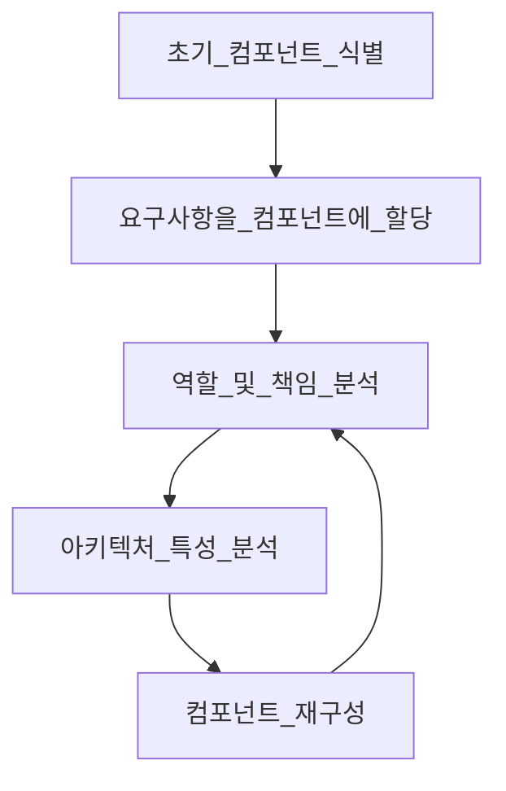

# 컴포넌트 기반 사고

모듈은 연관된 코드의 묶음이고, 아키텍트는 보통 모듈을 물리적으로 구현한 컴포넌트로 생각한다

## 8.1 컴포넌트 범위

컴포넌트는 아키텍처의 근본적인 모듈성을 구성하는 요소로 아주 중요한 고려 사항이다

아키텍트가 결정하는 중요 항목 중 하나가 아키텍처 컴포넌트의 최상위 분할과 연관되어 있다

## 8.2 아키텍트 역할

아키텍트는 아키텍처 내부의 컴포넌트를 정의, 개선, 관리, 통제하는 일을 한다

컴포넌트의 설계 업무는 기술 리더 혹은 개발자가 맡게 되는데, 아키텍트는 이러한 설계 결정에 관여해선 안된다

아키텍트는 컴포넌트를 명확히 식별해야 하기때문에, 아키텍처를 분할하는 방법을 반드시 이해해야 한다

### 8.2.1 아키텍처 분할

컴포넌트는 일반적인 적재(Containership) 매커니즘을 의마하므로 재량껏 어떤 유형으로든 분할할 수 있다

- 레이어드 아키텍처와 모듈러 모놀리스 아키텍처를 통해 최상위 아키텍처 분할을 설명함 (p.145)

> 시스템을 설계하는 조직은, 그 조직의 소통 구조를 그대로 옮겨 놓은 듯한 설계도를 그릴 수밖에 없다.
>
> - 콘웨이의 법칙

아키텍처의 구성 원칙 중 하나는 기술 관심사의 분리(Separation of technical concerns)다, 이를 통해 유용한 수준으 디커플링(Decoupling)을 만든다

기술 관심사를 통해 코드 베이스를 분할하면 개발 시의 코드 예측 가능성은 높아지지만, 현실적으로 대부분의 시스템은 여러 기술과 기능을 넘나드는 워크플로가 필요하다

도메인 분할 아키텍처로 워크플로와 도메인 중심으로 최상위 컴포넌트를 분리할 경우, 향후 발생 가능한 코드 변화에 더욱 유연하게 대응할 수 있다

### 8.2.2 분할 사례 연구: 실리콘 샌드위치

도메인 분할

- 장점
  - 세부 구현보다 비즈니스 기능에 더 가깝게 모델린된다
  - 역 콘웨이 전략을 활용하여 도메인별 다목적팀을 구성하기 쉽다
  - 모듈러 모놀리스와 마이크로서비스 아키텍처 스타일에 더 가깝게 맞출 수 있다
  - 메시지 흐름이 문제 영역과 일치한다
  - 데이터와 컴포넌트를 분산 아키텍처로 옮기기 쉽다
- 단점
  - 유저 정의 코드가 여기저기 산재한다

기술 분할

- 장점
  - 커스텀 코드가 명확하게 분리된다
  - 레이어드 아키텍처 패턴과 더 가깝게 맞출 수 있다
- 단점
  - 전역 커플링이 더 높다, 따라서 공통 또는 로컬 컴포넌트가 변경되면 다른 컴포넌트도 영향을 받을 가능성이 높다
  - 개발자가 공통 레이어, 로컬 레이어 양쪽에 도메인 개념을 복제해야 할 수도 있다
  - 일반적으로 데이터 레벨의 커플링이 높다

## 8.3 개발자 역할

아키텍트와 공동 설계한 컴포넌트를 바탕으로 클래스, 함수, 서브컴포넌트를 더 잘게 나눈다

개발자는 아키텍트가 설계한 컴포넌트가 최종판이라고 생각하면 안 된다

모든 소프트웨어 설계는 구현을 통해 상세한 것들을 조금씩 밝히며 하나씩 개선하며 점점 다듬어진다

## 8.4 컴포넌트 식별 흐름

컴포넌트 식별은 후보를 도출하고 피드백을 통해 다듬어가는 과정을 반복하는 것이 가장 바람직하다

아키텍처는 이런 주기를 반복하며 점점 구체화된다

### 8.4.1 초기 컴포넌트 식별

아키텍트는 소프트웨어 프로젝트 최상위에 적용할 컴포넌트 분할에 유형을 정해야 한다

원하는 컴포넌트를 자유롭게 구성하고, 서비스 도메인(기능)과 컴포넌트를 매핑해야 한다

아키텍트는 컴포넌트 설계를 이터레이션하며 조금씩 개선해야 한다

### 8.4.2 요구사항을 컴포넌트에 할당

초기 컴포넌트 식별 후, 도출된 컴포넌트에 요구사항(유저 스토리)를 대입하여 요구 조건에 충족하는지 확인한다

- 이 과정은 다음과 같은 작업이 주를 이룬다
  1. 새 컴포넌트를 만든다
  2. 기존 컴포넌트를 통합한다
  3. 너무 큰 컴포넌트를 분해한다

이 과정에서 매핑이 정확할 필요는 없으며, 이해관계자와 함께 확인하며 설계를 보완할 수 있도록 큼지막한 단위의 기반(Coarsegrained substrate)으로 정리하면 된다

### 8.4.3 역할 및 책임 분석

요구사항을 파악하는 단계에서 밝혀진 역할과 책임을 살펴보고 세분도(Granularity)가 적합한지 확인한다

애플리케이션이 지원해야 할 역활가 기능 모두 고려해야 컴포넌트와 도메인의 세분도를 서로 맞출 수 있다

이 과정도 매우 어려운 일이며, 이터레이션을 통해 조금씩 개선해야 한다

> 세분도
>
> 세분화한 정도, 즉 얼마나 잘게 나누었는가

### 8.4.4 아키텍처 특성 분석

식별한 아키텍처 특성들이 컴포넌트 분할과 세분도에 어떤 영향이 미치는지 확인해야 한다

순수하게 기능 관점으로 컴포넌트를 설계하면 유저 상호작용을 처리하는 단일 컴포넌트가 도출되지만, 아키텍처 특성을 함께 고렿면 더 하위 컴포넌트로 잘게 나눌 수 있다

### 8.4.5 컴포넌트 재구성

소프트웨어 설계는 피드백이 항상 중요하다

그 누구도 소프트웨어 프로젝트 도중에 발생하는 미지의 이슈를 예측할 수 없다

아키텍트는 개발자와 함께 지속적으로 컴포넌트 설계를 반복해야한다

- 컴포넌트 설계 시 설계를 반복하는 접근 방식이 중요한 이유
  1. 차후 재설계를 하게 만들지 모를 모든 발견과 특이 사례를 전부 고려하기란 불가능하다
  2. 아키텍트와 개발자는 구현 서비스의 이해도가 증가하면 각 기능과 역할에 대해 서로 다른 관점을 갖게 된다

## 8.5 컴포넌트 세분도

컴포넌트의 적절한 세분도를 찾는것은 매우 어렵다

- 잘게 나누어 설계하면 컴포넌트 간 통신이 증가한다
- 큰 덩어이로 컴포넌트를 설계하면 컴포넌트 내부 커플링이 증가하여 배포, 테스트가 어려워지고 모듈성 관점에서도 부정적인 영향을 미친다

## 8.6 컴포넌트 설계

아키텍트는 아키텍처를 설계하며 요구사항을 접수하고 애플리케이션을 구성할 구성 요소를 고민해야 한다

### 8.6.1

이해관계자와 협력하여 시스템에 관해 일반적인 지식과 시스템을 어떻게 분할할지(기술 분할 혹은 도메인 분할)를 결정해야 한다

초기 설계의 목표는 여러 아키텍처 특성을 고려하여 문제 영역을 큰 덩어리로 나누는 것이다

- 엔티티 함정(Entity trap)

  - 엔티티 함정을 조심해야 한다,
  - 문제 영역을 큰 덩어이로 나눌 때, 자칫 애플리케이션 워크플로를 오해하여 단순히 데이터베이스 관계를 프레임워크에 매핑한, 단순히 CRUD 수행을 위한 시스템이 나올 수 있다.
  - 이는 아키텍처 설계가 아닐뿐더러, 실제 애플리케이션의 워크플로에 관한 지식 부족을 나타내는 것이다.
  - 엔티티 함정에 빠져 생성된 너무 큰 컴포넌트는 전체적인 구조와 패키징 관점에서 개발팀에게 전혀 도움이 되지 않는다

- 액터/액션 접근법(Actor/Actions aooriach)

  - 애플리케이션에서 뭔가 일을 하는 액터와 그들이 수행하는 액션을 식별한다
  - 유저와 시스템이 어떤 종류의 일을 하는지 식별한다
  - 이렇게 도출된 요구사항을 컴포넌트에 매핑하기에 적합하다
  - 선행 설계(upfront design)에 매우 적합한 방식이다
  - 요구사항 측면에서 역할이 분명하고 수행해야하는 액션 종류가 확실할 때 매우 궁합이 좋다
  - 모놀리식, 분산 시스템 등 모든 종류의 컴포넌트 분할 방식에 통용된다

- 이벤트 스토밍(Event storming)
- 도메인 주도 설계(DDD)에서 사용하는 컴포넌트 발견 기법
- 다양한 컴포넌트가 메시지나 이벤트를 이용해 서로 통신한다고 가정한다
- 요구사항과 식별된 역할에 따라 시스템에서 어떤 이벤트가 발생하는지 파악한다[1]
- 컴포넌트를 이벤트와 메시지 핸들러 중심으로 구축하여 위에서 정리한 내용[1]을 반영한다
- 일관적인(Eventual) 시스템에서 사용할 메시지를 아키텍트가 정의할 수 있다
- 이벤트와 메시지를 사용하는 마이크로서비스와 같은 분산 아키텍처에 적합하다

- 워크플로 접근법(Workflow approach)
  - 이벤트 스토밍의 대안으로, DDD나 메시징을 사용하지 않는 방법
  - 이벤트 스토밍과 비슷하지만 메시지 기반 시스템 구축 시 명시적인 제약 조건이 없다
  - 핵심 역할을 식별하고 이 역할에 관여하는 워크플로 유형을 결정한다
  - 식별된 핵심 역할에 따라 컴포넌트를 구축한다

비교적 오래된 개발 프로세스를 사용하는 조직에서는 액터/액션 접근법이 더 적합하다

DDD, 마이크로서비스 같은 아키텍처를 쓰는 프로젝트는 이벤트 스토밍이 더 적합하다

## 8.7 컴포넌트 발굴 사례: GGG

구현법이 유일한 소프트웨어 시스템은 없다, 모든 설계는 서로 다른 트레이드오프 조합이 항상 뒤따른다

아키텍처는 하나의 완벽한 설계를 찾기위해 집착하면 안된다

모든 설계 결정의 트레이드오프를 객관적으로 판단하여 나쁜 것들 중에서 가장 나은 것을 선택한다

## 8.8 아키텍처 퀀텀 딜레마: 모놀리식이냐, 분산 아키텍처냐

- 모놀리식

  - 배포 단위가 하나이기 때문에, 데이트베이스를 사용해야하는 모든 시스템의 기능이 하나의 서비스에 모두 포함된다

- 분산 아키텍처

  - 네트워킹 프로토콜을 통해 서로 통신하는 여러 서비스로 구성된다
  - 서비스 별로 개발팀을 나눌 수 있다
  - 우선 순위를 정해 서비스 별 배포가 가능하다
  - 네트워크 비용은 무료가 아니다

이런 아키텍처 스타일은 근본적으로 아키텍처 퀀텀 수에 좌우된다

단일 퀀텀인 경우에는 모놀리식 아키텍처의 장점이 더 많다

아키텍처 퀀텀을 활용하면 초기 설계 단계에서 아키텍처의 근본적인 설계 특성(모놀리식/분산)을 결정할 수 있으므로 아키텍처 특성의 범위와 커플링을 분석하는 방법으로 매우 효과적이다
