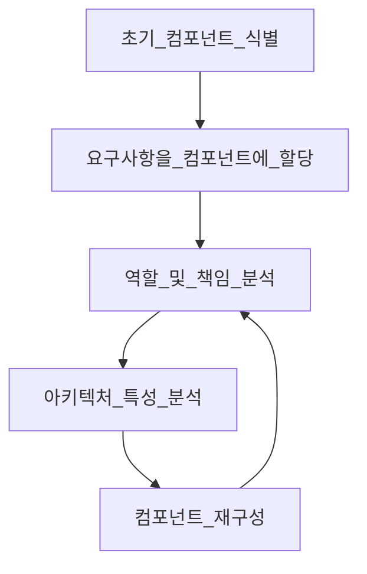

# 컴포넌트 기반 사고

모듈은 연관된 코드의 묶음이고, 아키텍트는 보통 모듈을 물리적으로 구현한 컴포넌트로 생각한다

## 8.1 컴포넌트 범위

컴포넌트는 아키텍처의 근본적인 모듈성을 구성하는 요소로 아주 중요한 고려 사항이다

아키텍트가 결정하는 중요 항목 중 하나가 아키텍처 컴포넌트의 최상위 분할과 연관되어 있다

## 8.2 아키텍트 역할

아키텍트는 아키텍처 내부의 컴포넌트를 정의, 개선, 관리, 통제하는 일을 한다

컴포넌트의 설계 업무는 기술 리더 혹은 개발자가 맡게 되는데, 아키텍트는 이러한 설계 결정에 관여해선 안된다

아키텍트는 컴포넌트를 명확히 식별해야 하기때문에, 아키텍처를 분할하는 방법을 반드시 이해해야 한다

### 8.2.1 아키텍처 분할

컴포넌트는 일반적인 적재(Containership) 매커니즘을 의마하므로 재량껏 어떤 유형으로든 분할할 수 있다

- 레이어드 아키텍처와 모듈러 모놀리스 아키텍처를 통해 최상위 아키텍처 분할을 설명함 (p.145)

> 시스템을 설계하는 조직은, 그 조직의 소통 구조를 그대로 옮겨 놓은 듯한 설계도를 그릴 수밖에 없다.
>
> - 콘웨이의 법칙

아키텍처의 구성 원칙 중 하나는 기술 관심사의 분리(Separation of technical concerns)다, 이를 통해 유용한 수준으 디커플링(Decoupling)을 만든다

기술 관심사를 통해 코드 베이스를 분할하면 개발 시의 코드 예측 가능성은 높아지지만, 현실적으로 대부분의 시스템은 여러 기술과 기능을 넘나드는 워크플로가 필요하다

도메인 분할 아키텍처로 워크플로와 도메인 중심으로 최상위 컴포넌트를 분리할 경우, 향후 발생 가능한 코드 변화에 더욱 유연하게 대응할 수 있다

### 8.2.2 분할 사례 연구: 실리콘 샌드위치

도메인 분할

- 장점
  - 세부 구현보다 비즈니스 기능에 더 가깝게 모델린된다
  - 역 콘웨이 전략을 활용하여 도메인별 다목적팀을 구성하기 쉽다
  - 모듈러 모놀리스와 마이크로서비스 아키텍처 스타일에 더 가깝게 맞출 수 있다
  - 메시지 흐름이 문제 영역과 일치한다
  - 데이터와 컴포넌트를 분산 아키텍처로 옮기기 쉽다
- 단점
  - 유저 정의 코드가 여기저기 산재한다

기술 분할

- 장점
  - 커스텀 코드가 명확하게 분리된다
  - 레이어드 아키텍처 패턴과 더 가깝게 맞출 수 있다
- 단점
  - 전역 커플링이 더 높다, 따라서 공통 또는 로컬 컴포넌트가 변경되면 다른 컴포넌트도 영향을 받을 가능성이 높다
  - 개발자가 공통 레이어, 로컬 레이어 양쪽에 도메인 개념을 복제해야 할 수도 있다
  - 일반적으로 데이터 레벨의 커플링이 높다

## 8.3 개발자 역할

아키텍트와 공동 설계한 컴포넌트를 바탕으로 클래스, 함수, 서브컴포넌트를 더 잘게 나눈다

개발자는 아키텍트가 설계한 컴포넌트가 최종판이라고 생각하면 안 된다

모든 소프트웨어 설계는 구현을 통해 상세한 것들을 조금씩 밝히며 하나씩 개선하며 점점 다듬어진다

## 8.4 컴포넌트 식별 흐름

컴포넌트 식별은 후보를 도출하고 피드백을 통해 다듬어가는 과정을 반복하는 것이 가장 바람직하다

아키텍처는 이런 주기를 반복하며 점점 구체화된다

### 8.4.1 초기 컴포넌트 식별
